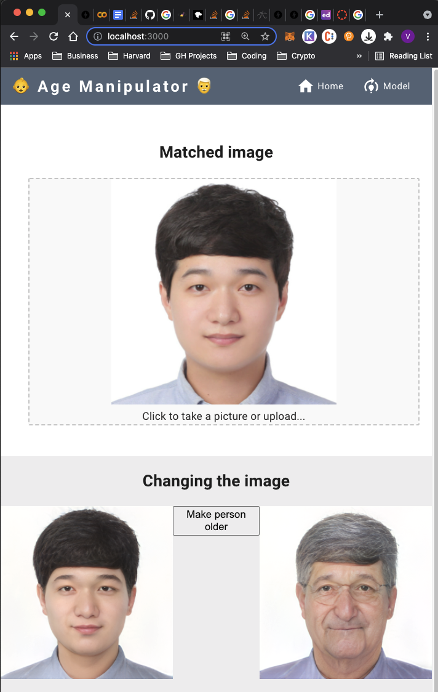
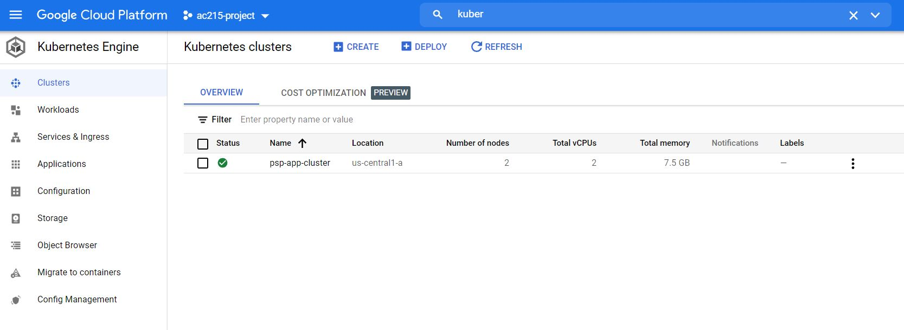
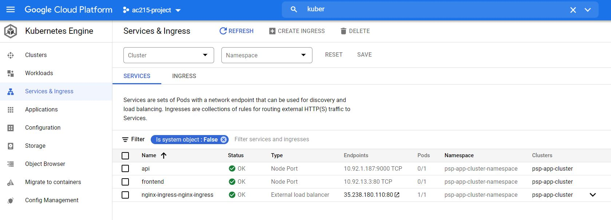

Milstone 4 - Style Transfer App
==============================
Harvard AC215

## Final presentation link
https://youtu.be/7fQYx9zeyoE

## Notebooks used

Inside [the notebooks](https://github.com/vazkir/Style-Transfer-App/tree/main/notebooks/psp) folder you can find the PSP folder which contains the notebooks we used in colab to:
- Run the original pytorch models
- Convert the pytoch models to ONNX format
- Run the onnx_tf models as tensorflow models

Do note that they have originally been ran in the cloud where have access to other specific PSP folders on where we have pytorch and other tools installed. 

If you want to actually run the notebooks, then please let use know so we can give you access to them.

## PSP API Service

[This folder](https://github.com/vazkir/Style-Transfer-App/tree/main/psp-api-service) contains the api we created that can do the following:
1) Load onnx_tf models into memory
2) Receive an input image as request which is then converted by our first model called 'psp.onnx' to a latent representation of the image which is returned
3) Receive a latent vector which is then mutated to aplpy an age vector. This mutated vector is then used as input and then run through our second "decoder.onnx" model to generate an image with this mutatation
  - For now we have hardcoded to use the age vector to create an older version of the person in the image

## React Frontend

[This contains](https://github.com/vazkir/Style-Transfer-App/tree/main/frontend-react) all our frontend code which leverages the api when an image gets uploaded. Then it gets a latent matched image back from the API. From which the user can then choose to apply an age vector to, to make the current image of a person look older

## Room for improvement

### Model load and inference time
Loading our models into memory already takes more then 2 minutes and gettingt the latent image match from the input image takes more than 10 minutes (!?). As you can notice, this is not optimal for the user experience at all. 

We want to therefore debug our models further in terms of the onnx conversion, since the pytorch model seemed to run way faster. 

### Changing other feature dimensions
Also currently the changing of the image is hardcoded to only change the age vector, while we alreay have the code inplace (which is also tested) to change other dimensions, like eye or gender.

We are planning to implement sliders in the frontend ASAP so the user has more control over how he or she wants to change the image

### Neural Style Transfer
We locally ran notebooks to apply NST, which weren't that fast since the model itself had to train. We have been reading the latest papaers regarding faster style transfer and have found some pre-trained models that can achieve NST within seconds.

We are also planning to get this functionality (besides changing the image in the latent space) to the application as soon as possible.

## A screenshot of our application running

## A screenshot of our Kuberneters cluster

## Contributing
Pull requests are welcome. For major changes, please open an issue first to discuss what you would like to change.

Please make sure to update tests as appropriate.

## License
[MIT](https://choosealicense.com/licenses/mit/)
