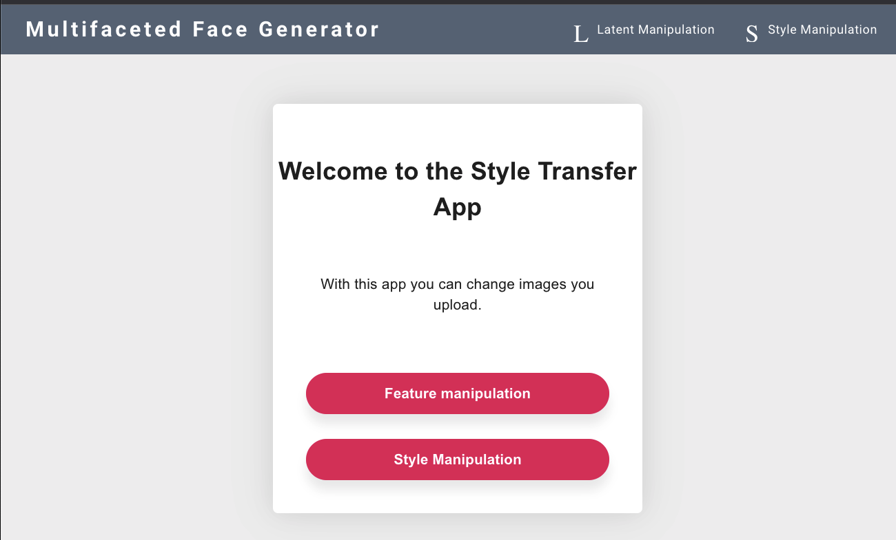
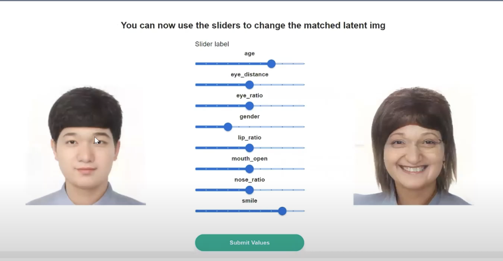
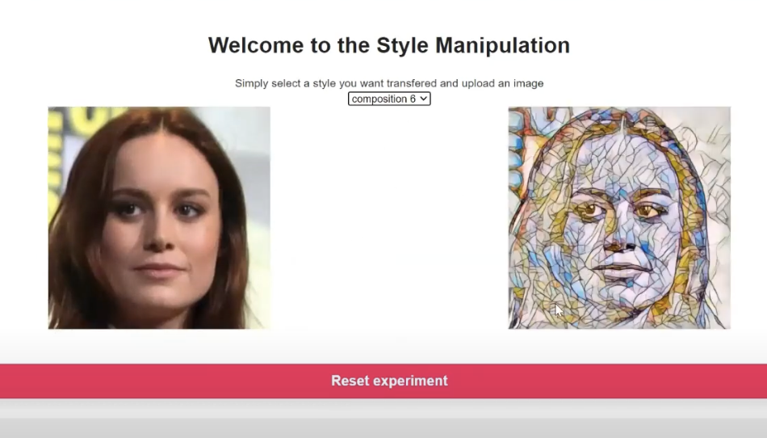

Milstone 4 - Style Transfer App
==============================
Harvard AC215


## Final presentation link
https://youtu.be/7fQYx9zeyoE


## Notebooks used

Inside [the notebooks](https://github.com/vazkir/Style-Transfer-App/tree/main/notebooks/psp) folder you can find the PSP folder which contains the notebooks we used in colab to:
- Run the original pytorch models
- Convert the pytoch models to ONNX format
- Run the onnx_tf models as tensorflow models

Do note that they have originally been ran in the cloud where have access to other specific PSP folders on where we have pytorch and other tools installed. 

If you want to actually run the notebooks, then please let use know so we can give you access to them.


## PSP API Service

[This folder](https://github.com/vazkir/Style-Transfer-App/tree/main/psp-api-service) contains the api we created that can do the following:
1) Load onnx_tf models into memory
2) Receive an input image as request which is then converted by our first model called 'psp.onnx' to a latent representation of the image which is returned
3) Receive a latent vector which is then mutated to aplpy an age vector. This mutated vector is then used as input and then run through our second "decoder.onnx" model to generate an image with this mutatation
  - For now we have hardcoded to use the age vector to create an older version of the person in the image


## React Frontend

[This contains](https://github.com/vazkir/Style-Transfer-App/tree/main/frontend-react) all our frontend code which leverages the api when an image gets uploaded. Then it gets a latent matched image back from the API. From which the user can then choose to apply an age vector to, to make the current image of a person look older


## The Application



On home screen, the user can choose between 1 of our 2 main functionalities:
- Latent Manipulation
- Style Manipulation


### Model load and inference time
Loading our models into memory already takes more then 2 minutes and gettingt the latent image match from the input image takes more than 10 minutes (!?). As you can notice, this is not optimal for the user experience at all. 

We want to therefore debug our models further in terms of the onnx conversion, since the pytorch model seemed to run way faster. 

### Changing other feature dimensions
The user can use the sliders in the screen to manipulate different feature vectors on 1 to 10 ratio. These values are later normalized within the api to get the actual range for the specific feature vector to apply.
Once you are done with changing the slides, you can click submit and then your latent matched image will be mutated by these settings. For example, you can see here an older, more feminine and more smiling Dongyun because he changed those sliders: 



### Neural Style Transfer
We locally ran notebooks to apply NST, which weren't that fast since the model itself had to train. We have been reading the latest papaers regarding faster style transfer and have found some pre-trained models that can achieve NST within seconds.

We have implemented the [Fast Neural Style Transfer](https://github.com/jcjohnson/fast-neural-style) models, from 6 different styles:
* Candy
* Mosaic
* La Muse
* Starry Night
* The Scream
* The Wave

 A user can upload their image and they'll get a styled-transfered image back in a few seconds


You can see 1 of the styles applied here:



## Deployement instructions


### API's to enable in GCP for Project
Search for each of these in the GCP search bar and click enable to enable these API's
* Compute Engine API
* Service Usage API
* Cloud Resource Manager API
* Google Container Registry API
* Kubernetes Engine API

### Start Deployment Docker Container
- Make sure you are in the root directory
-  `cd deployment`
- Run `sh docker-shell.sh` or `docker-shell.bat` for windows
- Check versions of tools
`gcloud --version`
`kubectl version`
`kubectl version --client`

- Check if make sure you are authenticated to GCP
- Run `gcloud auth list`

### Build and Push Docker Containers to GCR
**This step is only required if you have NOT already done this**
```
ansible-playbook deploy-docker-images.yml -i inventory.yml
```

### Create & Deploy Cluster
```
ansible-playbook deploy-k8s-cluster.yml -i inventory.yml --extra-vars cluster_state=present
```

### If you want to shell into a container in a Pod
```
kubectl get pods --namespace=mushroom-app-cluster-namespace
kubectl get pod api-5d4878c545-47754 --namespace=mushroom-app-cluster-namespace
kubectl exec --stdin --tty api-5d4878c545-47754 --namespace=mushroom-app-cluster-namespace  -- /bin/bash
```

### View the App
* Copy the `nginx_ingress_ip` from the terminal from the create cluster command
* Go to `http://<YOUR INGRESS IP>.sslip.io`

### Delete Cluster
```
ansible-playbook deploy-k8s-cluster.yml -i inventory.yml --extra-vars cluster_state=absent
```


## A screenshot of our Kuberneters cluster


## Contributing
Pull requests are welcome. For major changes, please open an issue first to discuss what you would like to change.

Please make sure to update tests as appropriate.

## License
[MIT](https://choosealicense.com/licenses/mit/)
